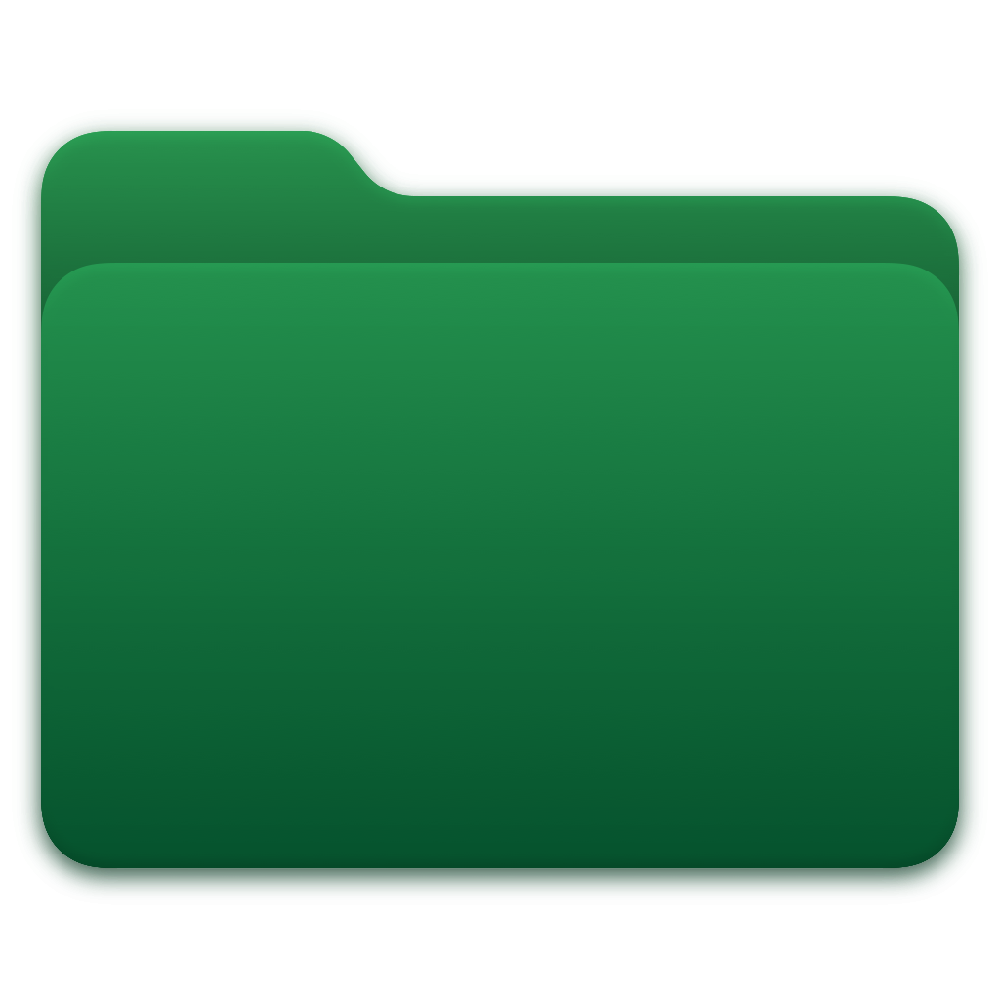

# FolderIcon 📂✨

**FolderIcon** is a sleek, premium macOS utility designed to help you organize and personalize your workspace by customizing folder icons with ease. Whether you want to color-code your projects, add descriptive SF Symbols, or use your own logos, FolderIcon makes it simple and fast.



## 🚀 Features

- **Exact Color Matching**: Colors are applied via a luminance-mapping technique — the folder keeps Apple's native shading, gloss and volume, while the hue is exactly the color you picked. No blue tint bleeds through.
- **Solid & Gradient Tinting**: Full HSB control for a solid color, or blend two colors at any angle. 24 handcrafted solid presets and 16 gradient presets.
- **SF Symbols Integration**: Access thousands of Apple's high-quality symbols. Search by category or enter any symbol name manually.
- **Emoji Support**: Use any emoji as a folder icon for a fun and expressive look.
- **Custom Images**: Drag and drop your own images or brand logos (supports transparency) to create truly unique folders.
- **History**: Every applied icon is saved automatically. Click any entry to re-apply its exact settings, or remove it with the ✕ button.
- **Real-time Preview**: See exactly how your folder will look before applying changes.
- **Bulk Processing**: Drag multiple folders at once to update them all in one click.
- **Reset to Default**: Restore original folder icons at any time.
- **Native Look & Feel**: Beautiful macOS-native UI with glassmorphism effects and support for Dark Mode.

## 🛠 Installation

### Option 1: Terminal (Recommended)

Build and install directly from the command line:

```bash
git clone https://github.com/ChornyiDev/FolderIcon.git
cd FolderIcon

# Build the release binary
xcodebuild -project FolderIcon.xcodeproj \
  -scheme FolderIcon \
  -configuration Release \
  -derivedDataPath build_output \
  build

# Install to /Applications
cp -R build_output/Build/Products/Release/FolderIcon.app /Applications/

# Optional: clean up build artifacts
rm -rf build_output

# Launch the app
open /Applications/FolderIcon.app
```

One-liner (copy-paste the whole block):

```bash
git clone https://github.com/ChornyiDev/FolderIcon.git && cd FolderIcon && \
xcodebuild -project FolderIcon.xcodeproj -scheme FolderIcon -configuration Release -derivedDataPath build_output build && \
cp -R build_output/Build/Products/Release/FolderIcon.app /Applications/ && \
rm -rf build_output && open /Applications/FolderIcon.app
```

### Option 2: Xcode

1. Open `FolderIcon.xcodeproj` in **Xcode (15.0+)**.
2. Press `Cmd + R` to run the app or `Cmd + B` to build it.

## 📖 How to Use

1. **Add Folders**: Drag one or more folders into the application window.
2. **Choose Style**:
   - **Color**: Pick Solid or Gradient tint, adjust hue/saturation/brightness, opacity, or use the presets.
   - **Icon**: Choose between SF Symbols, Emojis, or upload a Custom image.
   - **Details**: Refine the icon size and style (Vibrant, Original, Color, Inverted).
   - **History**: Browse previously applied icons; click one to re-apply its settings.
3. **Apply**: Click the **"Colorize"** button to apply the new icon to your folders instantly, or **Reset** to restore the default folder icons.

## 🍎 Technical Details

- **Language**: Swift 5.9+
- **Framework**: SwiftUI & AppKit
- **Platform**: macOS 14.0+
- **Icon rendering**: Luminance-map recolor (`CGBlendMode.multiply` over the folder silhouette) for pixel-accurate colors with native shading.

## 📄 License

This project is licensed under the MIT License - see the [LICENSE](LICENSE) file for details.

---

Created with ❤️ by **ChornyiDev**