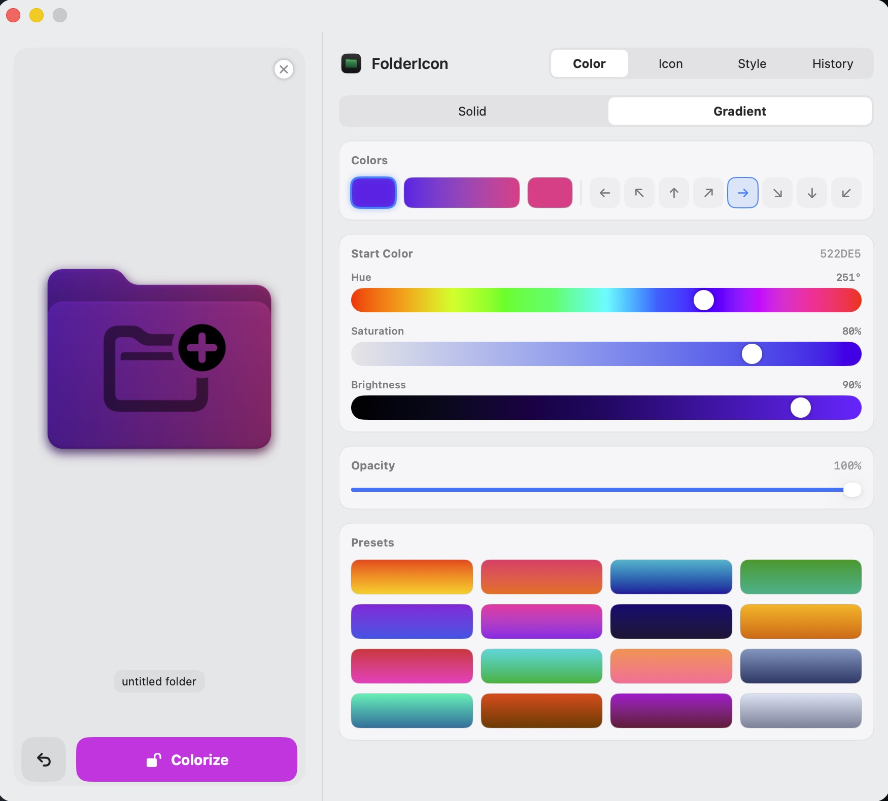
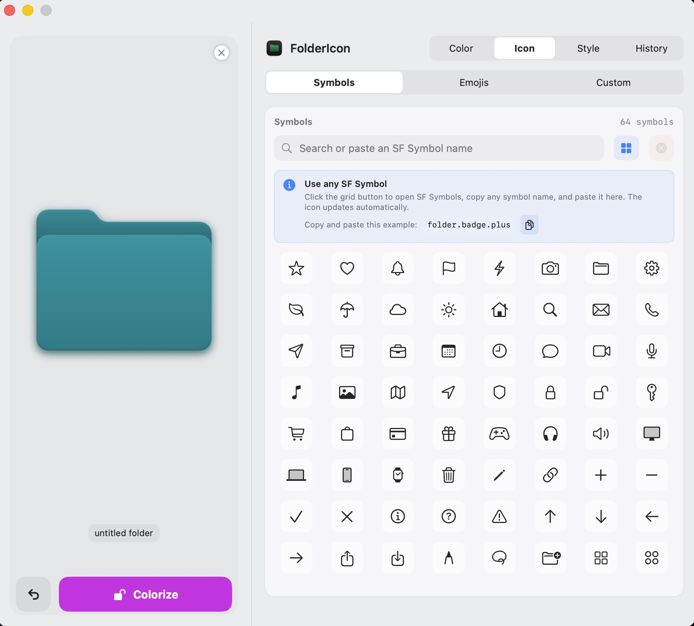
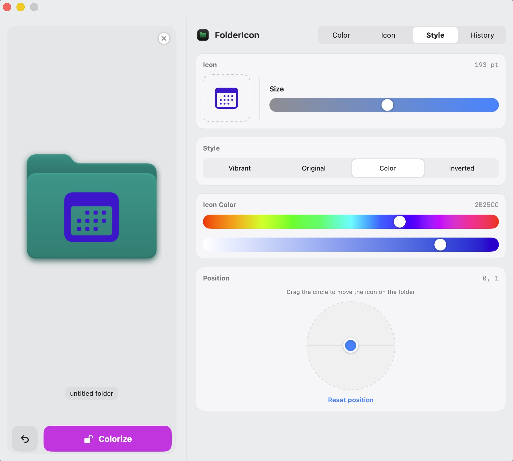
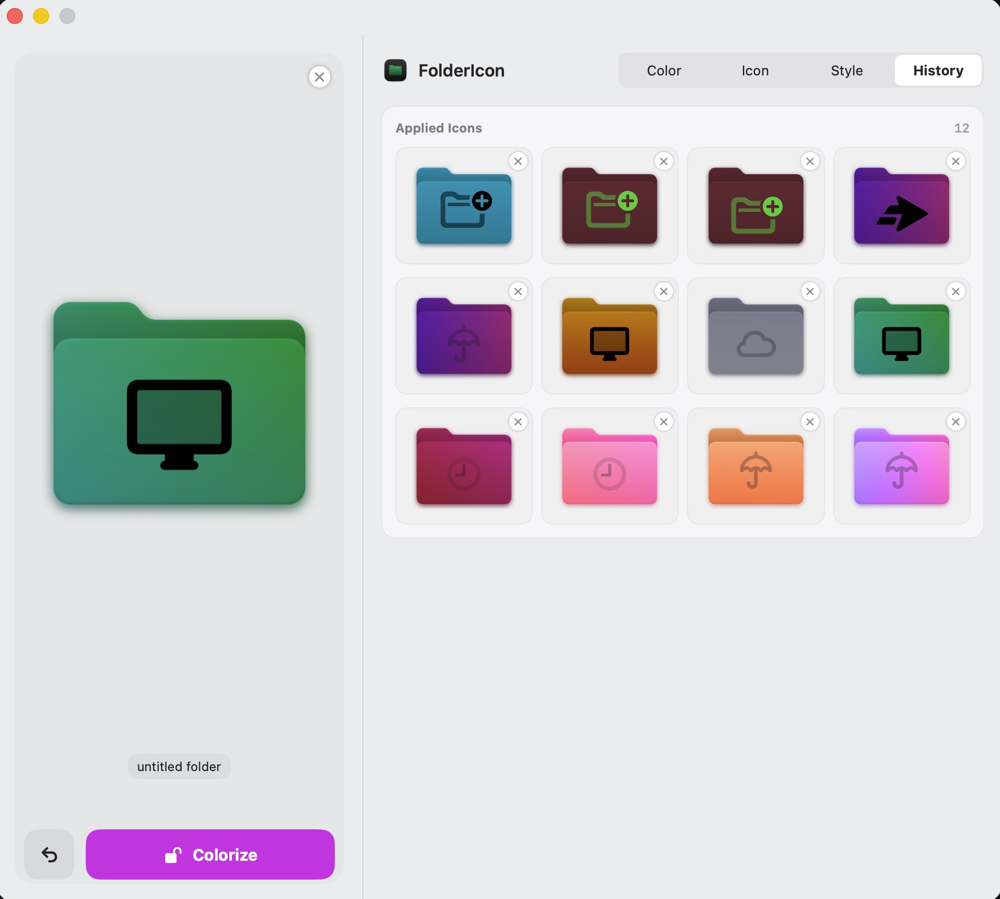

# FolderIcon 📂✨

**FolderIcon** is a sleek, premium macOS utility designed to help you organize and personalize your workspace by customizing folder icons with ease. Whether you want to color-code your projects, add descriptive SF Symbols, or use your own logos, FolderIcon makes it simple and fast.

## Preview

| Gradient colors | SF Symbols |
| --- | --- |
|  |  |
| Icon styling | History |
|  |  |

## 🚀 Features

- **Exact Color Matching**: Colors are applied via a luminance-mapping technique — the folder keeps Apple's native shading, gloss and volume, while the hue is exactly the color you picked. No blue tint bleeds through.
- **Solid & Gradient Tinting**: Full HSB control for a solid color, or blend two colors at any angle. 24 handcrafted solid presets and 16 gradient presets.
- **Opacity Control**: Folder opacity starts at 100% and can fade to fully transparent without revealing the original blue system folder.
- **SF Symbols Integration**: Browse 64 built-in symbols, or open Apple's SF Symbols app, copy any symbol name, and paste it into FolderIcon. A selectable example and Copy button make the workflow clear; invalid names are detected before rendering.
- **Emoji & Text**: Add up to four characters — a short label, several emoji, or a combination. Choose from 72 quick emoji presets; plain text follows the selected icon color/style.
- **Custom Images & SVG**: Choose or drag and drop PNG, JPEG, WebP, and SVG images (including transparency), or paste SVG code copied from SimpleIcons. Color and Inverted styles also work with SVG artwork.
- **Icon Style Controls**: Adjust icon size, position, color, and Vibrant, Original, Color, or Inverted rendering from the Style tab.
- **History**: The latest 100 applied icons are saved automatically. Click any entry to re-apply its exact settings, or remove it with the ✕ button.
- **Real-time Preview**: See exactly how your folder will look before applying changes.
- **Bulk Processing**: Drag multiple folders at once to update them all in one click.
- **Reset to Default**: Restore original folder icons at any time.
- **Native Look & Feel**: A focused macOS-native interface built with SwiftUI and AppKit.

## 🛠 Installation

### Option 1: Terminal (Recommended)

Build and install directly from the command line:

```bash
git clone https://github.com/ChornyiDev/FolderIcon.git
cd FolderIcon

# Build the release binary
xcodebuild -project FolderIcon.xcodeproj \
  -scheme FolderIcon \
  -configuration Release \
  -derivedDataPath build_output \
  build

# Install to /Applications
cp -R build_output/Build/Products/Release/FolderIcon.app /Applications/

# Optional: clean up build artifacts
rm -rf build_output

# Launch the app
open /Applications/FolderIcon.app
```

One-liner (copy-paste the whole block):

```bash
git clone https://github.com/ChornyiDev/FolderIcon.git && cd FolderIcon && \
xcodebuild -project FolderIcon.xcodeproj -scheme FolderIcon -configuration Release -derivedDataPath build_output build && \
cp -R build_output/Build/Products/Release/FolderIcon.app /Applications/ && \
rm -rf build_output && open /Applications/FolderIcon.app
```

### Option 2: Xcode

1. Open `FolderIcon.xcodeproj` in **Xcode 16 or newer**.
2. Press `Cmd + R` to run the app or `Cmd + B` to build it.

## 📖 How to Use

1. **Add Folders**: Drag one or more folders into the application window.
2. **Choose Style**:
   - **Color**: Pick Solid or Gradient tint, adjust hue/saturation/brightness, or change opacity from its 100% default.
   - **Icon**: Choose an included SF Symbol or paste any valid SF Symbol name; enter up to four emoji/text characters; or choose, drop, or paste SVG code for a Custom image.
   - **Style**: Refine icon size, position, color, and rendering mode (Vibrant, Original, Color, Inverted).
   - **History**: Browse previously applied icons; click one to re-apply its settings.
3. **Apply**: Click the **"Colorize"** button to apply the new icon to your folders instantly, or **Reset** to restore the default folder icons.

## 🍎 Technical Details

- **Language mode**: Swift 5
- **Framework**: SwiftUI & AppKit
- **Platform**: macOS 14.0+
- **Icon rendering**: Luminance-map recolor (`CGBlendMode.multiply` over the folder silhouette) for pixel-accurate colors with native shading.
- **Sandbox**: Read/write access is limited to folders explicitly selected by the user.

## ✅ Tests

Run the unit test suite from Terminal:

```bash
xcodebuild test \
  -project FolderIcon.xcodeproj \
  -scheme FolderIcon \
  -destination 'platform=macOS'
```

The tests cover the SF Symbols grid, emoji/text input limits, PNG/SVG image loading (including dropped SVG data), default and zero-opacity rendering, history pruning, and history state restoration.

## 📄 License

This project is licensed under the MIT License - see the [LICENSE](LICENSE) file for details.

---

Created with ❤️ by **ChornyiDev**
